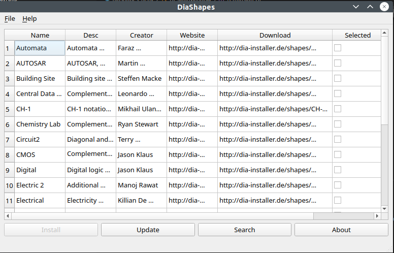

# Diashapes

App to install shapes for [Dia Diagram Editor](http://dia-installer.de), and alternative to the official [diashapes]
(http://dia-installer.de/diashapes/index.html.en) as it requires .net/mono to exist on your system.

## Running

execute `python3 diashapes_qt.py`, the project isn't properly packaged yet.

